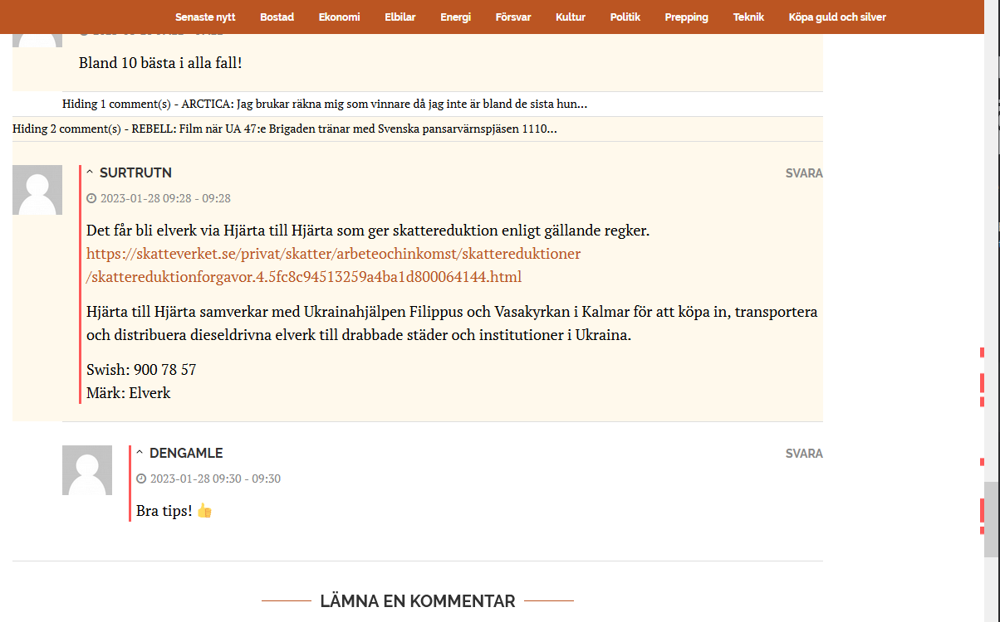

# Cornucopia Enhancement Suite

Cornucopia Enhancement Suite is a browser extension that adds several useful features to cornucopia.se. 

With this extension, you can easily keep track of new and updated content and comments which will be highlighted. The extension also includes a minimap, which displays all new content and comments in a convenient location on the right side of the screen. 

You can also collapse comment threads by clicking on the commenter's name or mark threads as 'favorites' using the star to get them highlighted in a specific color. It's also possible to always mark comments from certain users as favorites and to block users by always hiding their comments.

Finally you can navigate between new comments using keyboard shortcuts `J`/`K`. There's also `M` shortcut to collapse comments and `I` to jump to the first unread paragraph/comment.

Remember to check out the preferences for the extension.

Please note that the Cornucopia Enhancement Suite is not official or associated with cornucopia.se. It is a third-party extension that is not endorsed or supported by the website. Because of that, the extension might not work as intended if changes are made to the website.

## Links

* [Chrome web store](https://chrome.google.com/webstore/detail/cornucopia-enhancement-su/fodaamebkhjlgeaapmfikdjkleahllmb?hl=en-US&authuser=0)
* [Firefox Browser add-ons](https://addons.mozilla.org/en-US/firefox/addon/cornucopia-enhancement-suite/)