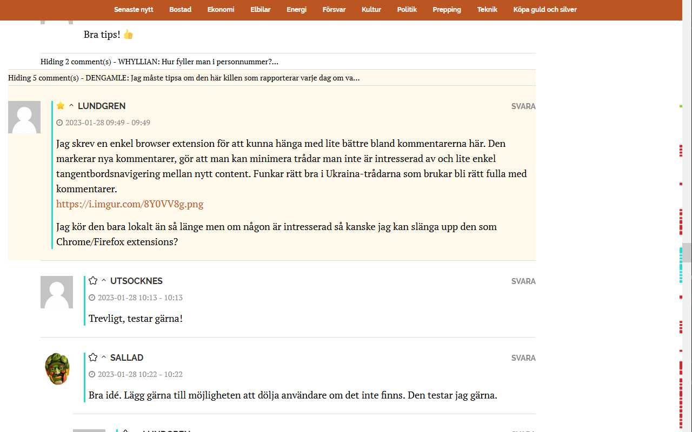

# Cornucopia Enhancement Suite

_Cornucopia Enhancement Suite_ is a 3rd party browser extension that improves the browsing experience on cornucopia.se with highlights for new comments, favorite threads, hidden content, and improved navigation.

## Links

* [Chrome web store](https://chrome.google.com/webstore/detail/cornucopia-enhancement-su/fodaamebkhjlgeaapmfikdjkleahllmb?hl=en-US&authuser=0)
* [Firefox Browser add-ons](https://addons.mozilla.org/en-US/firefox/addon/cornucopia-enhancement-suite/)
* [Opera addons](https://addons.opera.com/en/extensions/details/cornucopia-enhancement-suite/)

## Features

### Highlight new comments & content
All new comments and content since you last read the article will be highlighted with a colored border and in the minimap next to the scrollbar so they can be easily identified.

### Hide uninteresting discussions
All comment threads can be hidden by clicking on the authors name and will remain hidden until you open them again. An easy way to remove discussions you're not interested in. It's also possible to auto-hide all comments from users you're not interested in by listing them in the options view. 

### Favorite particularly interesting discussions
All comment threads can be marked as favorites by clicking on the star next to the authors name. Any responses to a favorite marked thread will highlighted in a special color so they are easier to find. Your own comments will be automatically marked as favorites so you'll easier see when someone respond to you.

It's also possible to mark all comments from your favorite users in the same color by listing them in the options view.

### Keyboard navigation
Quickly jump between all new comments and content using the keys `J` & `K`.

There's also `I` which will take you to the first unread item and `N` & `M` that will favorite and minimize the selected comment.

### Options
Checkout the built in options to change colors, favorite/unwanted users and other preferences. You can access option by locating _Cornucopia Enhancement Suite_ in your browsers extension list and click options there.

Please note that the Cornucopia Enhancement Suite is not official or associated with cornucopia.se. It is a third-party extension that is not endorsed or supported by the website. Because of that, the extension might not work as intended if changes are made to the website.